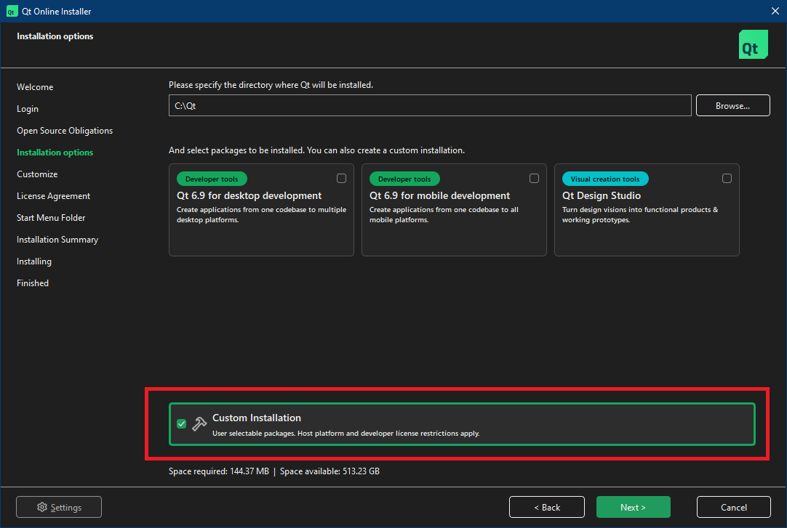
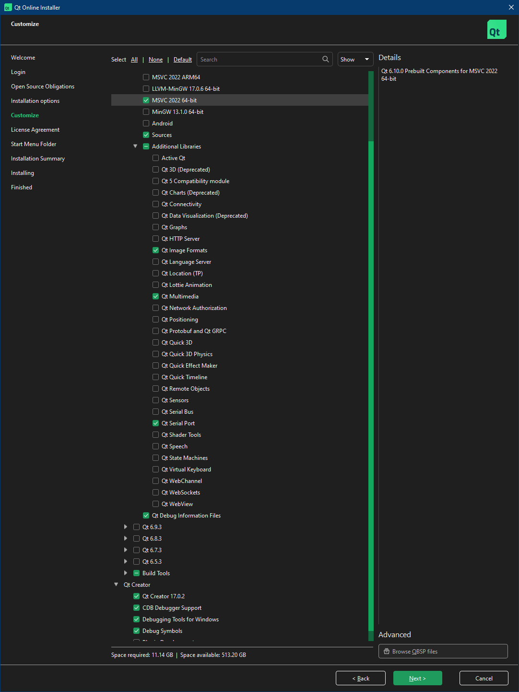
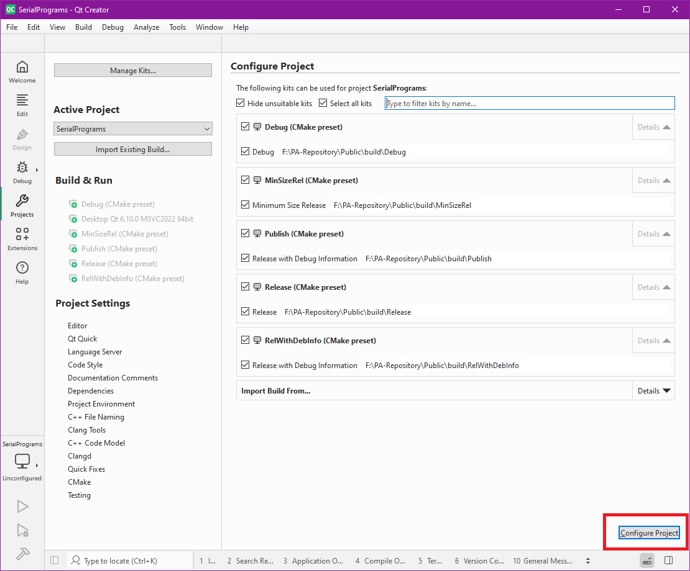
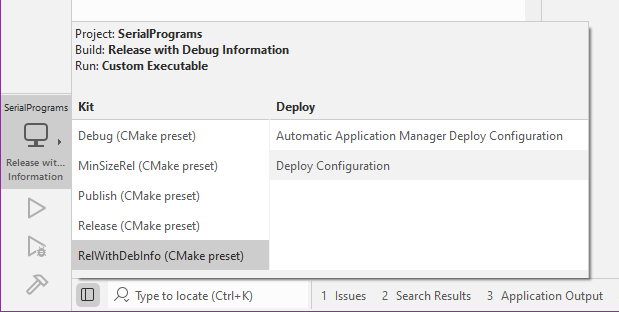

# How to Build (Qt 6.10.0) - Windows

## Build Tools:

The installation order here is important. While other orderings may work, this is the specific order that we have tested. And the Qt installation must be the last thing installed.

1. Install Visual Studio 2022:
    1. [Download Page](https://docs.microsoft.com/en-us/visualstudio/releases/2022/release-notes)
    2. Make sure you select the C++ development tools.
2. Install Windows Development SDK:
    1. [Download Page](https://developer.microsoft.com/en-us/windows/downloads/windows-sdk/)
3. Install CMake:
    1. [Download Page](https://cmake.org/download/)
    2. When prompted select, "Add CMake to the system PATH for all users".

## Install Qt 6.10.0:

Unlike with Qt 5.12, there is no offline installer for it. So you have two options here, use the online installer, or use a copy of an installation.

### Official Online Installer:

If you are ok with creating an account with Qt and using their online installer, then use this method.

1. Download the online installer from here: [https://www.qt.io/download-qt-Images/](https://www.qt.io/development/download-qt-installer-oss)
3. Select the following options: 
    - Qt 6.10.0
        - MSVC 2022 64-bit
        - Sources
        - Additional Libraries
            - Qt Image Formats
            - Qt Multimedia
            - Qt Serial Port
        - Qt Debug Information Files
    - Qt Creator
        - Qt Creator 17.0.2
        - CDB Debugger Support
        - Debugging Tools for Windows
        - Debug Symbols

If you repeatedly run into an error involving "SSL handshake failed", you will not be able to use the online installer. Please try the other option.

### Unofficial Installation Copy:

If you are unable or unwilling to use the online installer, the alternative is to copy an installation directly into your system. To do this, you will need to download the installation from us, and copy it into your C drive.

1. Join our [Discord server](https://discord.gg/cQ4gWxN) and ask for the link to the Qt6 standalone. Someone will DM you with a link*.
2. Download `Qt6.10.0.7z` and decompress it. You can use [7-zip](https://www.7-zip.org/) to decompress it. This will create a folder with the same name.
3. Move this folder to `C:\`. It will probably ask you for permissions to do it.
4. Navigate to: `C:\Qt6.10.0\Tools\QtCreator\bin\` and create a shortcut to `qtcreator.exe`. Copy this shortcut to somewhere convenient. (By default this shortcut is named, `Qt Creator 17.0.2 (Community)`)

*This Qt6 standalone file is 3GB in size and is being hosted by our staff for our own developers. We don't want the entire world converging here and overrunning the server.

## Setup:

1. Clone this repo.

TODO

## Troubleshooting

TODO

## Upgrading Qt components

TODO

**Discord Server:** 

