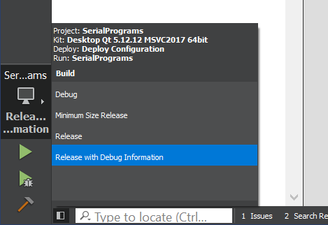
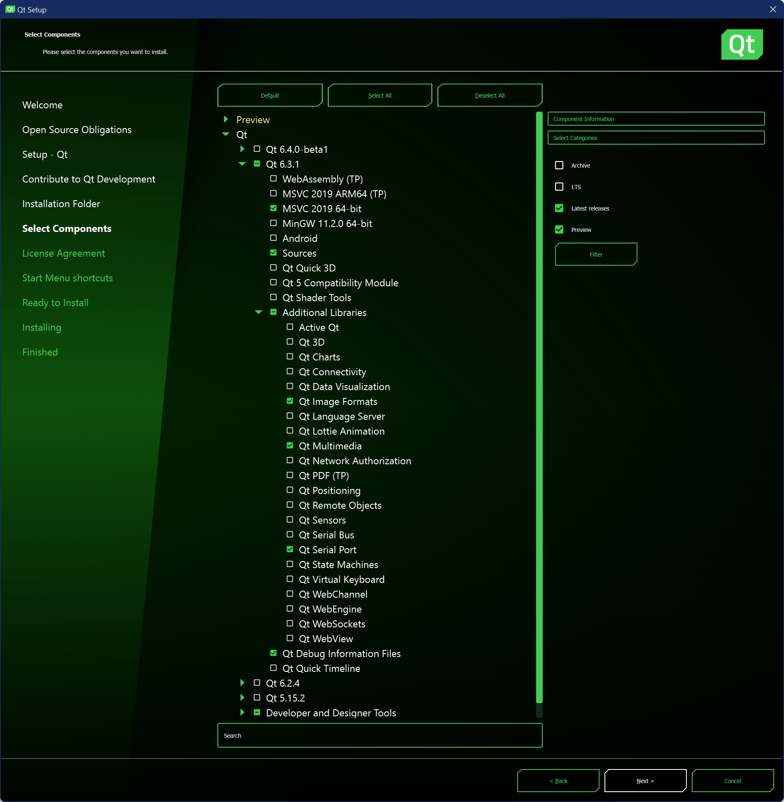

# Serial Programs

Source code for the "Computer Control" programs.

**Jump To:**
- [How to Build (Qt 5.12) - Windows](#how-to-build-qt-512---windows)
- [How to Build (Qt 6.3) - Windows](#how-to-build-qt-63---windows)

# How to Build (Qt 5.12) - Windows

## Build Tools:

1. Install Visual Studio 2019:
    1. [Download Page](https://docs.microsoft.com/en-us/visualstudio/releases/2019/release-notes)
    2. Make sure you select the C++ development tools.
2. Install Windows Development SDK:
    1. [Download Page](https://developer.microsoft.com/en-us/windows/downloads/windows-sdk/)
3. Install CMake:
    1. [Download Page](https://cmake.org/download/)
    2. When prompted select, "Add CMake to the system PATH for all users".
4. Install Qt 5.12.12:
    1. [Download the offline installer.](https://www.qt.io/offline-installers) [Direct Download Link](https://download.qt.io/official_releases/qt/5.12/5.12.12/qt-opensource-windows-x86-5.12.12.exe)
    2. Disconnect from the internet. This is needed to keep it from forcing you to create an account.
    3. Run the installer.
    4. When prompted for components, select all of the following:
        - Qt 5.12.12
            - MSVC 2017 32-bit
            - MSVC 2017 64-bit
            - MinGW 7.3.0 32-bit
            - MinGW 7.3.0 64-bit
        - Developer and Designer Tools
            - Qt Creator 5.0.2 CDB Debugger Support
            - MinGW 7.3.0 32-bit
            - MinGW 7.3.0 64-bit

## Setup:

1. Clone this repo.
2. Clone the [Packages Repo](https://github.com/PokemonAutomation/Packages).
3. In the `Packages` repo, copy the `SerialPrograms/Resources` folder into the root of the `Arduino-Source` repo.

4. Open Qt Creator.
5. Click on `Projects` -> `Open`.
6. Navigate to [`SerialPrograms`](./) and select `CMakeLists.txt`.
7. It will then ask you to configure the project. Select `Desktop Qt 5.12.12 MSVC2017 64bit`*.
8. At the bottom left corner, click on the little monitor and select `Release with Debug Information`.
9. Click the upper green arrow** to compile and launch the program.

*Even though it says "MSVC2017", it will be using your MSVC 2019 installation instead.

**Note that you will not be able to feasibly run with a debugger attached. This is because Qt Creator places a breakpoint on every single thrown exception and this application heavily uses exceptions even for non-error situations. So the debugger will break on literally everything. If you know how to disable break on exceptions, please let us know.

# How to Build (Qt 6.3) - Windows

## Build Tools:

1. Install Visual Studio 2019:
    1. [Download Page](https://docs.microsoft.com/en-us/visualstudio/releases/2019/release-notes)
    2. Make sure you select the C++ development tools.
2. Install Windows Development SDK:
    1. [Download Page](https://developer.microsoft.com/en-us/windows/downloads/windows-sdk/)
3. Install CMake:
    1. [Download Page](https://cmake.org/download/)
    2. When prompted select, "Add CMake to the system PATH for all users".

## Install Qt 6.3:

Unlike with Qt 5.12, there is no offline installer for it. So you have two options here, use the online installer, or use a copy of an installation.

### Official Online Installer:

1. Download the online installer from here: https://www.qt.io/download-qt-installer
2. Select the following options: 

If you repeatedly run into an error involving "SSL handshake failed", you will not be able to use the online installer. Please try the other option.

### Unofficial Installation Copy:

If you are unable or unwilling to use the online installer, the alternative is to copy an installation directly into your system. To do this, you will need to download the installation from us, and copy it into your C drive.

1. Join our [Discord server](https://discord.gg/cQ4gWxN) and ask for the link to the Qt6 standalone. Someone will provide you with a link.
2. Download `Qt6.3.1.7z` and decompress it. You can use [7-zip](https://www.7-zip.org/) to decompress it. This will create a folder with the same name.
3. Move this folder to `C:\`. It will probably ask you for permissions to do it.
4. Navigate to: `C:\Qt6.3.1\Tools\QtCreator\bin\` and create a shortcut to `qtcreator.exe`. Copy this shortcut to somewhere convenient. (By default this shortcut is named, `Qt Creator 7.0.2 (Community)`)

## Setup:

1. Clone this repo.
2. Clone the [Packages Repo](https://github.com/PokemonAutomation/Packages).
3. In the `Packages` repo, copy the `SerialPrograms/Resources` folder into the root of the `Arduino-Source` repo.

4. Open Qt Creator.
5. Click on `Projects` -> `Open`.
6. Navigate to [`SerialPrograms`](./) and select `CMakeLists.txt`.
7. It will then ask you to configure the project. Select `Desktop Qt 6.3.1 MSVC2019 64bit`.
8. At the bottom left corner, click on the little monitor and select `Release with Debug Information`.
9. Open up the file `CMakeLists.txt`. Change `QT_MAJOR` to `6`.
10. Click the upper green arrow to compile and launch the program.

